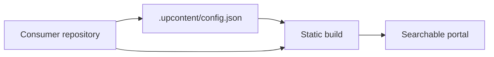

import PaletteShowcase from './src/components/PaletteShowcase.astro';

Upcontent turns Markdown into a searchable static documentation site. Configure the consumer repository, add the content formats your team needs, and publish the generated `dist/` directory to a static host.

## Rendered content

The portal accepts ordinary Markdown and adds a small set of useful content features.

### Callouts

:::tip[Use callouts for decisions]
Keep callouts short. Use them for a warning, a recommendation, or a next action that should not disappear in the surrounding text.
:::

:::caution
Static output is public wherever the selected host is public. A private source repository does not automatically make the published site private.
:::

### Code and diagrams

```ts
export function buildPortal(contentPath: string) {
  return `make build CONTENT_PATH=${contentPath}`
}
```



Mermaid diagrams support theme synchronization, fullscreen, zoom, pan, source copying, and an invalid-source fallback.

### Structured examples

JSON and YAML blocks remain readable as collapsible data:

```json
{
  "portal": "static",
  "search": "pagefind",
  "themes": ["light", "dark"]
}
```

```yaml
contentPath: ./docs
publish: github-pages
sourceOfTruth: consumer-repository
```

CSV becomes a table when the content is tabular:

```csv
capability,status
custom-css,available
blocklist,available
pagefind,available
```

### Links and navigation

Regular Markdown links are best for stable routes, such as [site validation](../guides/validate-your-site/). Wiki links are useful when the source repository refers to files by name, such as `[[README]]`. Missing wiki-link targets fail the build instead of producing broken navigation.

## Consumer customization

The consumer changes identity and presentation in `.upcontent/`, without editing the portal renderer:

```text
.upcontent/
├── config.json
├── favicon.svg
├── logo.svg
└── theme.css
```

The configuration controls:

- Site title, description, URL, logo, and favicon
- Repository links and local custom CSS
- Social links, table of contents, pagination, last-updated metadata, and code styling
- Sidebar roots, labels, and content blocklists
- The frontmatter field used as a page title

Example identity configuration:

```json
{
  "site": {
    "title": "Engineering Docs",
    "description": "Documentation for the engineering team.",
    "logo": {
      "src": ".upcontent/logo.svg",
      "alt": "Engineering Docs"
    },
    "favicon": ".upcontent/favicon.svg"
  },
  "repo": {
    "url": "https://github.com/acme/engineering-docs"
  },
  "theme": {
    "customCss": [".upcontent/theme.css"]
  }
}
```

The [configuration reference](../customization/config-json/) explains every supported field and its fallback behavior.

### Palette variations

The same Starlight surface can carry different consumer identities through tokens and custom CSS:

<PaletteShowcase />

These are examples for a consumer repository, not a runtime theme picker that every published portal needs to expose.

## Content boundaries

The build excludes protected internal paths and consumer blocklists before parsing. This keeps excluded files out of both the content collection and the sidebar.

```json
{
  "navigation": {
    "blocklist": {
      "exact": ["notes.md"],
      "prefixes": ["drafts/", "internal/"]
    }
  }
}
```

Broken wiki links and traversal attempts fail with the source file and invalid reference. The same pipeline also works when `CONTENT_PATH` points to a separate consumer repository.

## Validation and publishing

The repeatable local contract is:

```sh
pnpm test
pnpm check
make build CONTENT_PATH=.
make check-external
```

The reference CI workflow validates the site and an external consumer fixture. The deployment workflow publishes `dist/` to a static host such as GitHub Pages.

## Explore the product

- [Your first build](../getting-started/first-build/)
- [Set up a consumer repository](../getting-started/consumer-repository/)
- [Authoring content](../guides/authoring-content/)
- [Validate your site](../guides/validate-your-site/)
- [Deployment](../deployment/)
