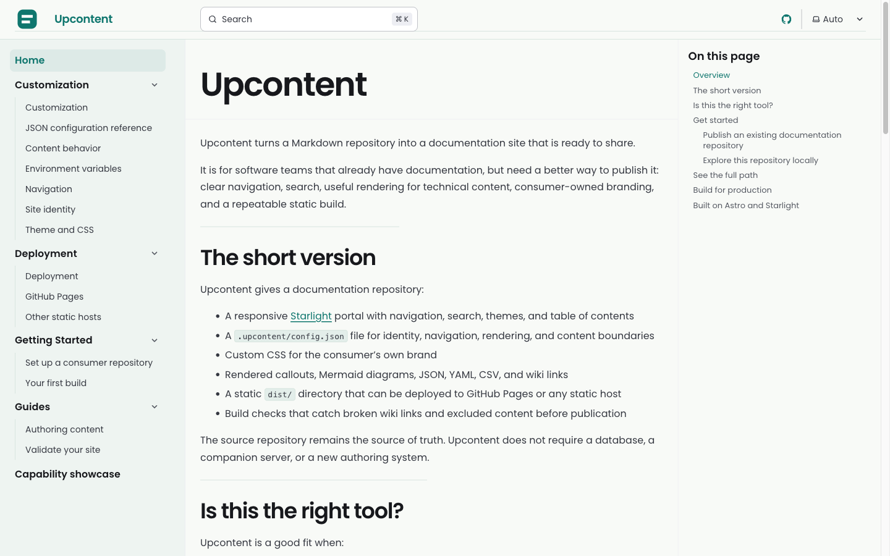
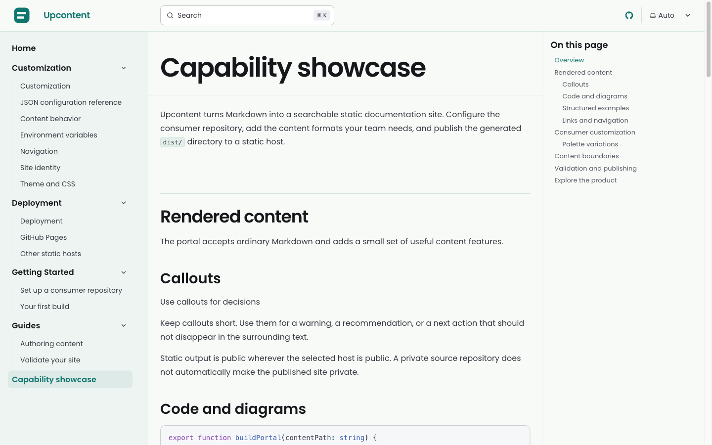

Upcontent turns the documentation repository you already have into a fast, searchable, customizable portal.

[](https://github.com/lumamontes/upcontent/actions/workflows/ci.yml)
[](https://www.npmjs.com/package/upcontent)

## Explore Upcontent

- [See the live portal](https://lumamontes.github.io/upcontent/)
- [Explore the capability showcase](showcase/)
- [Set up a consumer repository](getting-started/consumer-repository/)
- [Run your first build](getting-started/first-build/)
- [Configure content](customization/content/)
- [Configure navigation](customization/navigation/)
- [Configure search visibility](customization/seo/)
- [Customize the portal](customization/)
- [Validate before publishing](guides/validate-your-site/)
- [Publish to GitHub Pages](deployment/github-pages/)
- [Publish to another static host](deployment/static-hosts/)
- [Publish releases through npm](deployment/npm/)

## See the result

This is the real Upcontent portal generated from this repository and deployed to GitHub Pages.

<p align="center">
  <a href="https://lumamontes.github.io/upcontent/"></a>
</p>

The same build includes a capability showcase for technical content, structured data, callouts, diagrams, navigation, and search.

<p align="center">
  <a href="showcase/"></a>
</p>

## From repository to portal

Upcontent keeps your source of truth in Git and adds the publishing layer: clear navigation, full-text search, technical content rendering, consumer-owned branding, and a repeatable static build.

If your Markdown already lives in a GitHub repository, the flow is:

```sh
pnpm dlx upcontent init
pnpm dlx upcontent dev
pnpm dlx upcontent check
```

The first command creates `.upcontent/` and a GitHub Pages workflow. The second starts a local portal using the repository you are already in. The third builds the consumer portal and validates the generated site. You do not need to clone the Upcontent renderer into your documentation repository.

Push the generated workflow and your documentation is published as a static site. The source repository remains the source of truth; Upcontent does not require a database, a companion server, or a new authoring system.

## What you get

- A responsive [Starlight](https://starlight.astro.build/) portal with navigation, search, themes, and table of contents.
- A `.upcontent/config.json` file for identity, navigation, rendering, and content boundaries.
- Consumer-owned logos, favicon, CSS, site identity, and navigation.
- Rendered callouts, Mermaid diagrams, JSON, YAML, CSV, and wiki links.
- A static `dist/` directory deployable to GitHub Pages or any static host.
- Build checks that catch broken wiki links and excluded content before publication.

## Is it a good fit?

Upcontent is a good fit when:

- Your documentation already lives in Markdown or MDX.
- Your team wants to keep writing in Git.
- You want the portal to be owned and deployed by the documentation repository.
- You need more than raw Markdown, but do not need a dynamic application.
- You want branding and navigation without maintaining a custom docs frontend.

It is not the right fit when your site needs runtime authentication, server-rendered personalization, or review comments inside the published portal.

## Explore this repository locally

Clone this repository, then start the included golden consumer:

```sh
git clone https://github.com/lumamontes/upcontent.git
cd upcontent
pnpm install
make dev CONTENT_PATH=.
```

Then open the local URL printed by Astro. The [capability showcase](showcase/) is the fastest way to see the complete rendering and customization surface.

## Configure your portal

The consumer configuration is deliberately small:

```json
{
  "site": {
    "title": "Engineering Docs",
    "description": "Documentation for the engineering team.",
    "socialImage": "https://docs.example.com/social-card.png",
    "locale": "en-US",
    "logo": {
      "src": ".upcontent/logo.svg",
      "alt": "Engineering Docs"
    },
    "favicon": ".upcontent/favicon.svg"
  },
  "seo": {
    "enabled": true
  },
  "repo": {
    "url": "https://github.com/acme/engineering-docs"
  },
  "theme": {
    "customCss": [".upcontent/theme.css"]
  }
}
```

Follow [Set up a consumer repository](getting-started/consumer-repository/) for the complete setup, then use [Customization](customization/) to shape the portal.

## Build for production

```sh
make build CONTENT_PATH=/path/to/your-consumer-repo
```

The generated site is written to `dist/` and includes the Pagefind search index. Before publishing, run:

```sh
pnpm test
pnpm check
make build CONTENT_PATH=.
make check-external
```

Read the [deployment guide](deployment/) for GitHub Pages and other static hosts.

## Built on Astro and Starlight

Upcontent uses the official [Astro](https://astro.build/) framework and [Starlight](https://starlight.astro.build/) documentation theme as its rendering foundation. Upcontent adds the consumer-repository contract, content integrity checks, configuration surface, and deployment workflow around them.
